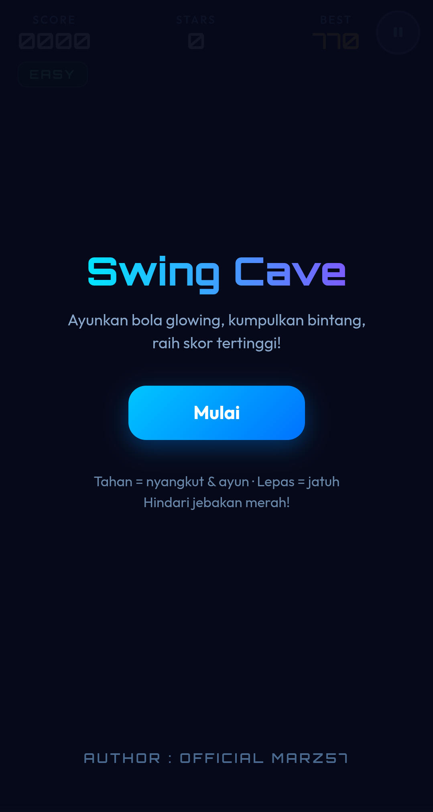
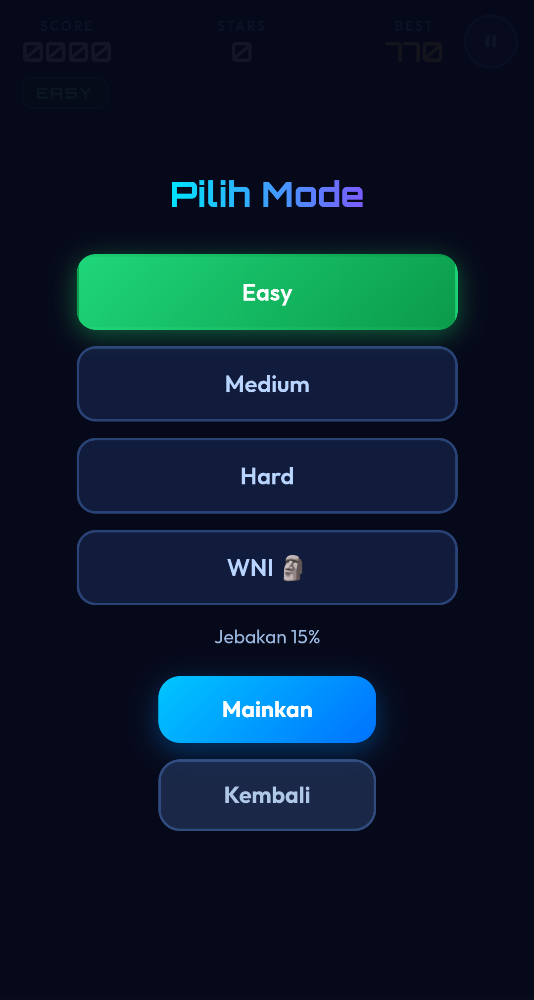
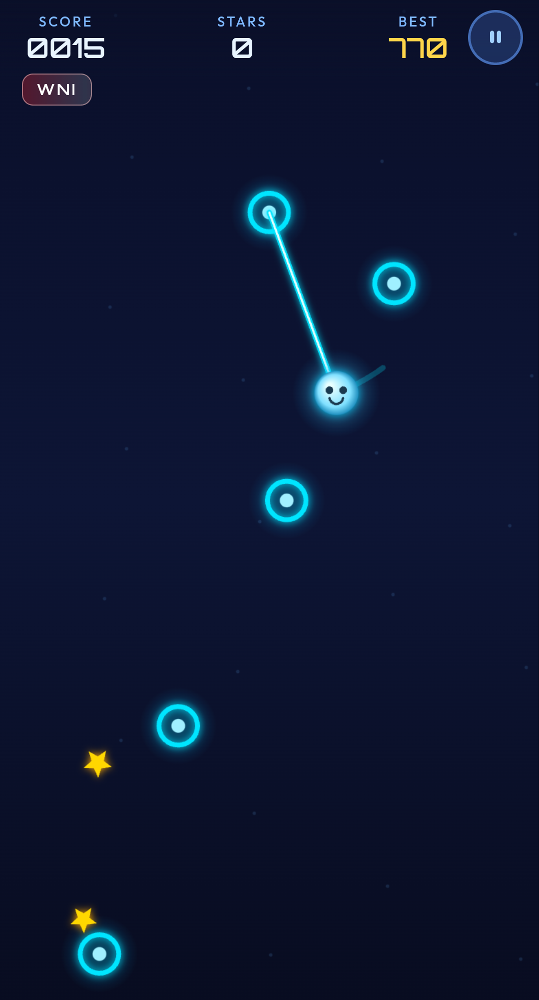

# 🎮 SWING CAVE GAMES

***Preview 1***


***Preview 2***


***Preview 3***


**SWING CAVE GAMES** adalah game browser berbasis **HTML, CSS, Vanilla JavaScript, dan HTML5 Canvas**.

Game ini dibuat oleh **Official Marz57** dan dapat dijalankan di browser menggunakan local server, sehingga bisa dimainkan **secara offline** setelah seluruh file project tersedia di perangkat.

## ✨ Fitur

- 🎯 Gameplay swing menggunakan node/tali
- ⭐ Sistem score dan star
- 🔥 Combo system
- 🏆 Best score tersimpan di `localStorage`
- 🎮 Mode Easy, Medium, Hard, dan WNI
- 📱 Mendukung kontrol pointer/touch
- ⏸️ Pause dan countdown
- 🌐 Bisa dimainkan secara offline
- 💻 Tidak membutuhkan database atau VPS

---

## 📁 Struktur Project

Contoh struktur folder:

```text
SWING-CAVE-GAMES/
├── assets/
│   └── css
│       └── style.css
│   └── js
│       └── logic.js
├── README.md
├── index.html
└── screenshoot.jpg
```

> Nama file/folder dapat berbeda tergantung versi project. Pastikan `index.html` memanggil file CSS, JavaScript, dan asset dengan path yang benar.

---

## Ingin Mencoba Langsung?
> jika ingin bermain secara online, bisa dicoba langsung <a href="https://marz-games.vercel.app">Klik Disini</a> untuk mencoba game nya secara langsung

---

# 🚀 Instalasi

## 1. Download / Clone dari GitHub

Jika menggunakan Git:

```bash
git clone https://github.com/Marz57/Swing-Cave-Games
cd Swing-Cave-Games
```

Atau download repository sebagai ZIP lalu extract.

---

# 🌐 Menjalankan Secara Offline

Game sebaiknya dijalankan menggunakan **local server**, bukan langsung membuka `index.html` dengan `file://`.

Beberapa pilihan local server:

- Apache
- Python HTTP Server
- Termux
- PHP built-in server
- VS Code Live Server
- Server lokal lainnya

---

# 🐧 Linux — Apache

### Install Apache

Debian / Ubuntu / Kali:

```bash
sudo apt update
sudo apt install apache2
```

### Jalankan Apache

```bash
sudo systemctl start apache2
```

Cek status:

```bash
sudo systemctl status apache2
```

### Masukkan game ke folder Apache

Dari folder project:

```bash
sudo cp -r . /var/www/html/swing-cave-games
```

Kemudian buka browser:

```text
http://localhost/swing-cave-games/
```

### Menghentikan Apache

```bash
sudo systemctl stop apache2
```

---

# 🐍 Python HTTP Server

Jika Python sudah terpasang, Apache tidak diperlukan.

Masuk ke folder game:

```bash
cd SWING-CAVE-GAMES
```

Jalankan (jalankan di dalam folder game nya):

```bash
python3 -m http.server 8000
```

Kemudian buka:

```text
http://localhost:8000
```

Untuk menghentikan server:

```text
CTRL + C
```

### Windows

```cmd
cd SWING-CAVE-GAMES
python -m http.server 8000
```

Kemudian buka:

```text
http://localhost:8000
```

---

# 📱 Android — Termux

Game juga dapat dijalankan secara offline menggunakan **Termux**.

## 1. Install Python

```bash
pkg update
pkg install python
```

## 2. Izinkan akses penyimpanan

```bash
termux-setup-storage
```

## 3. Masuk ke folder game

Contoh jika game berada di Downloads:

```bash
cd ~/storage/downloads/SWING-CAVE-GAMES
```

## 4. Jalankan server

```bash
python -m http.server 8000
```

Kemudian buka browser Android:

```text
http://127.0.0.1:8000
```

atau:

```text
http://localhost:8000
```

Game dapat dimainkan tanpa koneksi internet selama seluruh file project sudah tersedia di perangkat.

Untuk menghentikan server:

```text
CTRL + C
```

---

# 🖥️ Alternatif: PHP

Jika PHP sudah terpasang:

```bash
cd SWING-CAVE-GAMES
php -S localhost:8000
```

Buka:

```text
http://localhost:8000
```

---

# 🎮 Cara Bermain

## 🖱️ PC / Laptop

1. Mulai game.
2. Klik/tahan pada node yang ingin digunakan untuk swing.
3. Karakter akan terhubung ke node.
4. Lepaskan pointer untuk melepaskan swing.
5. Manfaatkan momentum untuk bergerak menuju node berikutnya.
6. Hindari jebakan.
7. Kumpulkan ⭐ star.
8. Pertahankan combo.
9. Dapatkan score setinggi mungkin.

## 📱 Android / Touchscreen

1. Sentuh dan tahan pada node.
2. Karakter akan melakukan swing.
3. Lepaskan sentuhan untuk detach.
4. Arahkan pergerakan menuju node berikutnya.
5. Hindari jebakan dan kumpulkan star.

---

# ⚙️ Game Mode

| Mode | Keterangan |
|---|---|
| Easy | Tingkat lebih mudah |
| Medium | Tingkat normal |
| Hard | Tingkat lebih sulit |
| WNI | Jebakan sangat tinggi |

Semakin tinggi tingkat kesulitan, semakin besar tantangannya.

---

# 💾 Penyimpanan Score

Game menggunakan **browser `localStorage`** untuk menyimpan data seperti best score dan pengaturan mode.

Artinya:

- Data tersimpan di browser/perangkat yang digunakan.
- Tidak membutuhkan database online.
- Data tidak otomatis berpindah ke perangkat lain.
- Menghapus data browser/localStorage dapat menghapus best score.

---

# 🔌 Sepenuhnya Offline

Setelah repository di-download, game dapat dimainkan tanpa internet:

```text
Download repository
       ↓
File game tersimpan di perangkat
       ↓
Local Server
       ↓
Browser
       ↓
🎮 SWING CAVE GAMES
```

Tidak diperlukan:

- ❌ VPS
- ❌ Database online
- ❌ Hosting untuk bermain lokal
- ❌ Internet saat bermain
- ❌ Game engine tambahan

Yang diperlukan:

- ✅ File project
- ✅ Browser
- ✅ Local server seperti Apache, Python, PHP, atau Termux

---

# 🌍 GitHub Pages

Jika ingin game dapat dimainkan langsung melalui internet:

1. Push project ke GitHub.
2. Buka repository.
3. Masuk ke **Settings**.
4. Pilih **Pages**.
5. Pilih branch yang digunakan.
6. Pilih folder `/root` jika project berada di root repository.
7. Klik **Save**.
8. Tunggu proses deployment selesai.

Pastikan file utama bernama:

```text
index.html
```

GitHub Pages kemudian akan menyediakan alamat website untuk game.

---

# 🛠️ Teknologi

Project ini dibuat menggunakan:

- **HTML5**
- **CSS3**
- **Vanilla JavaScript**
- **HTML5 Canvas**
- **LocalStorage**

Tidak menggunakan game engine khusus.

---

# 👨‍💻 Developer

**Official Marz57**

**Project:** SWING CAVE GAMES

---

```text
Copyright © Official Marz57
```
